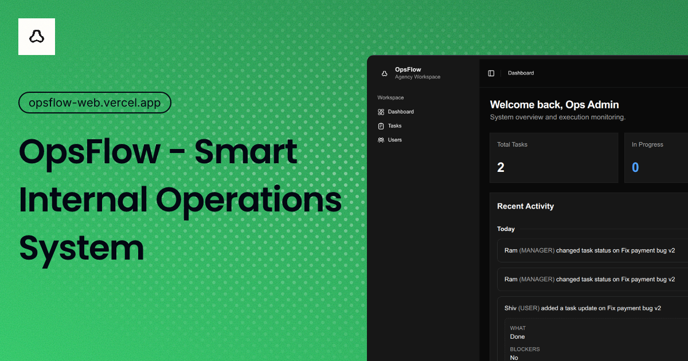

# OpsFlow: Smart Internal Operations System



OpsFlow is a lightweight internal operations platform focused on improving task execution clarity, accountability, and visibility.

Instead of feature-heavy task management, it emphasizes structured updates where every task clearly communicates:

- what was done
- blockers
- next steps

This helps teams reduce ambiguity and understand progress without relying on scattered communication.

## What this version focuses on

This MVP demonstrates core product thinking and system design:

- Role-based access (Admin, Manager, User)
- Task management and assignment
- Structured task updates
- Unified activity timeline
- Simple role-aware dashboards

The focus is on clarity of execution over feature breadth.

## Note

OpsFlow is a developing product. This version showcases key workflows and decisions, not a complete system.

Future improvements would include better collaboration, analytics, time tracking and estimation for each task and real-time capabilities.

## Tech stack

| Area     | Choices                                                                                       |
| -------- | --------------------------------------------------------------------------------------------- |
| Monorepo | Turborepo, Bun workspaces                                                                     |
| Web      | React 19, React Router 7, Vite, Tailwind CSS 4, TanStack Query, Zustand, React Hook Form, Zod |
| API      | Bun, Express 5, JWT (cookies), CORS                                                           |
| Data     | PostgreSQL, Prisma 7                                                                          |
| UI       | Shared `packages/ui` (shadcn-style components)                                                |

## Prerequisites

- [Bun](https://bun.sh) 1.2.x (see `packageManager` in root `package.json`)
- PostgreSQL 16+ (local install or Docker via `packages/db/docker-compose.yml`)

## Environment variables

Copy `packages/db/.env.example` and use the same values in:

- **`apps/server/.env`** (API and Prisma CLI; see `packages/db/prisma.config.ts`)
- **`packages/db/.env`** (admin seeder loads this when you run `seed:admin` from `packages/db`)

| Variable           | Description                                           |
| ------------------ | ----------------------------------------------------- |
| `DATABASE_URL`     | PostgreSQL connection string                          |
| `CORS_ORIGIN`      | Allowed browser origin (e.g. `http://localhost:5173`) |
| `JWT_TOKEN_SECRET` | Secret for signing session tokens                     |

Optional (for `seed:admin`): `ADMIN_EMAIL`, `ADMIN_PASSWORD`, `ADMIN_NAME`, `SEED_ADMIN_FORCE`.

Create **`apps/web/.env`** for the frontend:

| Variable          | Example                 |
| ----------------- | ----------------------- |
| `VITE_SERVER_URL` | `http://localhost:3000` |

## Setup

```bash
bun install
```

Start PostgreSQL if needed:

```bash
bun run db:start
```

Apply the schema (migrations are in `packages/db/prisma/migrations`):

```bash
bun run db:migrate
# or, for a quick local sync without migration history:
# bun run db:push
```

Generate Prisma types:

```bash
bun run db:generate
```

Seed the initial admin user (uses `apps/server/.env`):

```bash
bun --cwd packages/db run seed:admin
```

Run web and API together:

```bash
bun run dev
```

- Web: [http://localhost:5173](http://localhost:5173)
- API: [http://localhost:3000](http://localhost:3000) (health: `GET /`)

Other useful scripts: `bun run db:studio`, `bun run build`, `bun run check-types`.

## Engineering Decision Document

### 1. System Architecture

OpsFlow follows a simple full-stack architecture:

- React frontend for UI
- Express-based API for business logic
- PostgreSQL with Prisma for data persistence

The system is structured as a monorepo using Turborepo to keep frontend, backend, and shared packages in sync.

Communication flow:
Client → API → Database

The architecture is intentionally simple to prioritize clarity and speed of development.

---

### 2. Database Design

A relational database (PostgreSQL) was chosen to model structured relationships:

- Users
- Tasks
- TaskUpdates
- ActivityLogs

Key relationships:

- A task belongs to a creator and an assignee
- A task has many updates
- A task has many activity logs

This structure ensures consistency and makes querying timelines and task state straightforward.

---

### 3. Key Decisions

**Structured Updates over Comments**
Instead of a generic comment system, structured updates were introduced to enforce clarity in communication. Each update captures progress, blockers, and next steps.

**Unified Timeline**
Activity logs and updates are combined into a single timeline to provide a complete view of task history.

**Role-Based Access Control**
Three roles were implemented:

- Admin: system-level control
- Manager: task coordination
- User: execution

This keeps responsibilities clear and realistic.

**SQL over NoSQL**
A relational database was chosen due to clear relationships between entities and the need for consistent querying.

---

### 4. Trade-offs

- Did not implement real-time updates to keep scope focused
- No comments or chat system to avoid unstructured communication
- Limited filtering and search to keep the system simple
- No project/workspace layer to avoid overengineering

The goal was to build a focused system rather than a feature-heavy one.

---

### 5. Scaling Strategy

If the system grows to 10,000+ users:

Potential bottlenecks:

- Timeline queries (large activity logs)
- Task listing with filters

Improvements:

- Add pagination and indexing to all the apis
- Introduce caching for dashboard data
- Split activity logs into a separate service if needed
- Use background jobs for heavy operations

---

### 6. Future Improvements

With more time, the following would be added:

- Real-time updates (WebSockets)
- Task time tracking and estimation
- Notifications system
- Better analytics and reporting
- Project and workspace management
- Better way to invite users and manage teams

The current system focuses on core execution workflows and leaves room for these enhancements.

## Links

- **Deployed app:** [OpsFlow](https://opsflow-web.vercel.app/)
- **Postman collection:** [Postman Api Collection](https://aditya-8343.postman.co/workspace/Aditya-Joshi~656fbee4-cf23-4ac7-b1dc-64ae2f568928/collection/24138226-004bfa50-39be-4231-89ed-52f61c37265e?action=share&source=copy-link&creator=24138226)
